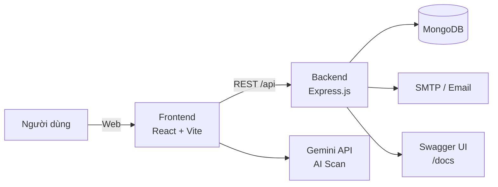

# UniFlow Monorepo

Hệ thống quản lý học tập dành cho môn kiểm thử: quản lý thời khóa biểu, bài tập, ghi chú, nhắc nhở và báo cáo. Dự án tách riêng Frontend/Backend để dễ phát triển và kiểm thử.

## 1. Title & Description
**UniFlow** là ứng dụng web hỗ trợ sinh viên tổ chức lịch học, theo dõi bài tập, ghi chú theo môn và nhắc nhở thông minh. Mục tiêu chính là làm nền tảng cho việc **phân tích – kiểm thử** các chức năng web.

## 2. Introduction
UniFlow được xây dựng theo mô hình monorepo:
- `frontend/` (React + Vite) cho giao diện và tương tác người dùng.
- `backend/` (Express + MongoDB) cung cấp REST API, xác thực và lưu trữ dữ liệu.

Ứng dụng có tích hợp quét thời khóa biểu bằng AI (Gemini) để nhập lịch nhanh chóng.

## 3. Key Features
- Xác thực người dùng: đăng ký, đăng nhập, quên/đặt lại mật khẩu.
- Quản lý thời khóa biểu theo ngày/tuần, hỗ trợ xuất lịch (PDF/CSV).
- Bài tập: tạo/sửa/xóa, trạng thái, độ ưu tiên, nhắc nhở.
- Ghi chú theo môn học và nhắc nhở ghi chú.
- Trang tổng quan thống kê học tập (biểu đồ & số liệu).
- Swagger API docs tại `/docs`.

## 4. Overall Architecture


## 5. Installation
Yêu cầu:
- Node.js >= 18
- npm >= 9
- MongoDB (local hoặc cloud)

Cài đặt:
```bash
cd backend
npm install

cd ../frontend
npm install
```

## 6. Running the Project
Chạy Backend:
```bash
cd backend
npm run dev
```

Chạy Frontend:
```bash
cd frontend
npm run dev
```

Chạy nhanh từ root:
```bash
npm run backend
npm run frontend
```

API chạy mặc định tại: `http://localhost:5050`  
Frontend chạy mặc định tại: `http://localhost:3000`

## 7. Env Configuration
### Backend: `backend/.env`
```env
PORT=5050
MONGODB_URI=mongodb+srv://<user>:<pass>@cluster/UniFlow_DB
JWT_SECRET=your_secret
SMTP_HOST=smtp.your-provider.com
SMTP_PORT=587
SMTP_USER=your_email
SMTP_PASS=your_password
EMAIL_FROM=uniflow@localhost
APP_BASE_URL=http://localhost:5050
RESET_TOKEN_TTL_MINUTES=30
```

### Frontend: `frontend/.env.local`
```env
GEMINI_API_KEY=your_gemini_key
```

## 8. Folder Structure
```bash
.
├── backend
│   ├── server.js
│   ├── package.json
│   └── ...
├── frontend
│   ├── components
│   ├── services
│   ├── constants.tsx
│   ├── App.tsx
│   └── ...
├── swagger.yaml
├── README.md
└── package.json
```

## 9. Contribution Guidelines
1. Fork dự án và tạo nhánh mới:
   ```bash
   git checkout -b feature/ten-chuc-nang
   ```
2. Viết code kèm mô tả rõ ràng.
3. Kiểm tra chạy được trước khi gửi PR.
4. Tạo Pull Request với mô tả ngắn gọn, rõ ràng.

## 10. License
Hiện chưa có file `LICENSE`. Mặc định **All Rights Reserved**.  
Bạn có thể bổ sung license phù hợp (ví dụ MIT) khi cần chia sẻ công khai.

## 11. Roadmap
- Bổ sung báo cáo thống kê nâng cao theo học kỳ.
- Nâng cấp xuất lịch thành `.xlsx` thay vì CSV.
- Tăng độ phủ test tự động (unit/integration).
- Cải thiện UI/UX cho chế độ mobile.
- Phân quyền người dùng (giảng viên/sinh viên).

## Examples
### Tạo lịch học (REST API)
```bash
curl -X POST http://localhost:5050/api/events \
  -H "Authorization: Bearer <token>" \
  -H "Content-Type: application/json" \
  -d '{
    "title": "Kiểm thử phần mềm",
    "startDate": "2026-01-12",
    "startTime": "07:00",
    "endTime": "09:40",
    "type": "REGULAR"
  }'
```

### Mở Swagger
Truy cập: `http://localhost:5050/docs`
